Proyecto EDA Python for data : Proyecto Marketing Bancario

# Análisis exploratorio de datos (EDA): Campaña de marketing bancario


## Descripción
Este proyecto desarrolla un análisis exploratorio de datos (EDA) y la verificación de suposiciones de negocio sobre las campañas de telemarketing directo de una institución financiera. El objetivo principal es identificar los patrones demográficos, operativos y macroeconómicos que condicionan la suscripción de depósitos a plazo fijo, aportando recomendaciones estratégicas fundamentadas en los datos para optimizar los costes de adquisición del banco.

---

## 🎯 Objetivos
* Comprender el comportamiento y perfil de la cartera de clientes.
* Identificar las variables demográficas y de campaña con mayor impacto en la conversión.
* Detectar y mitigar anomalías o valores atípicos en el histórico de llamadas.
* Validar o refutar las hipótesis y creencias de la dirección comercial del banco.

---

## 📁 Estructura del proyecto
La arquitectura del repositorio se organiza siguiendo las mejores prácticas de modularidad e ingeniería de datos:

    JC_PythonData_EDA
	    ├──.venv
        ├── .env                    # Credenciales locales ocultas (No se sube a Git)
        ├── .gitignore              # Exclusiones de Git (Protege .venv y .env)
        ├── README.md               # Documento maestro que explica el  proyecto/pasos.
        ├── requirements.txt        # Librerías de Python requeridas para la ejecución
		└──proyecto-marketing-bancario/
            ├── data/                   
            │   ├── raw/                # Los archivos originales (CSV y Excel) sin tocar.
            │   └── processed/          # Dataset final unificado y saneado (Capa de producción)
            ├── sql/                   
            │   ├── queries_val.sql     # Consultas para validar la integridad en la base de datos
            ├── notebooks/              
            │   └── eda_banco.ipynb  # Cuaderno de Jupyter con el ciclo completo de código
            └── reports/                
                └── figuras/            # Gráficas .png  exportadas para el informe ejecutivo

---

## Arquitectura y ciclo de vida del dato 🏗️ 
El flujo de procesamiento (ETL) y el almacenamiento se han estructurado en un modelo de capas para asegurar la trazabilidad del linaje del dato y la idempotencia del pipeline:

1. **Capa de ingesta (Raw layer):** Persistencia inmutable de los archivos externos planos en las tablas SQL `raw_bank` y `raw_customers`.
2. **Capa de integración (Staging layer):** Consolidación del cruce (*merge*) en la tabla SQL `stg_total_bank_customer`. Mantiene el dato unificado conservando los nulos y anomalías para la auditoría de origen.
3. **Capa de producción (Production layer):** Dataset refinado tras la limpieza matemática, guardado permanentemente en la tabla SQL `prd_marketing_cleaned` y respaldado físicamente en la carpeta `data/processed/`. Esta capa implementa una estrategia de **doble persistencia** optimizada para el consumo analítico.

---           

## Tecnologías utilizadas 🛠️ 
* **Python 🐍:** Lenguaje base del entorno de análisis.
* **Pandas & NumPy:** Manipulación de estructuras de datos en memoria y operaciones vectoriales rápidas.
* **SQLAlchemy:** Conexión y persistencia de las capas de datos en el motor relacional.
* **Matplotlib & Seaborn:** Creación de visualizaciones estadísticas avanzadas con identidad visual corporativa unificada.

## 🔐 Gestión de Credenciales y Seguridad (Buenas Prácticas DevOps)

Para cumplir con los estándares, **este proyecto no almacena credenciales de base de datos de forma fija (hardcoded) dentro del código del cuaderno**. Esto previene la fuga accidental de contraseñas personales al subir el proyecto a repositorios públicos como GitHub.

#### Pasos para la configuración local de accesos detallada tambien en los pasos de instalación. 

1. **Creación del archivo contenedor:** En la raíz absoluta del proyecto (`JC_PythonData_EDA/`), cree un archivo llamado exactamente `.env`.

2. **Declaración de variables:** Abra el archivo con un editor de texto y defina sus parámetros de conexión locales a PostgreSQL:

   ```text
   DB_USER=tu_usuario_de_postgres
   DB_PASSWORD=tu_contraseña_real
   DB_HOST=localhost
   DB_PORT=5432
   DB_NAME=proyecto_marketing
>
## Instalación y despliegue del entorno 💻 

Para levantar el proyecto y replicar el pipeline de datos de forma exitosa, siga estrictamente el siguiente orden operativo desde su consola:

1. **Clonación e Infraestructura Base:** ⚠️⚠️IMPORTANTE⚠️⚠️
   * Clone el repositorio localmente y sitúese en la raíz del directorio (`JC_PythonData_EDA`).
   * Abra su cliente de base de datos (**DBeaver**) y ejecute la sentencia de creación del contenedor físico:
     ```sql
     CREATE DATABASE proyecto_marketing;
     ```

2. **Aislamiento del Entorno y Dependencias:**
   * Inicialice y active el entorno virtual local (`.venv`) desde su terminal.
   * Instale el catálogo de librerías empaquetadas ejecutando:
     ```powershell
     pip install -r requirements.txt
     ```
     *(Este paso instalará de forma automatizada las dependencias de análisis y el módulo `python-dotenv` necesario para la abstracción de credenciales).*

3. **Inyección Segura de Parámetros de Entorno (.env):** ⚠️⚠️IMPORTANTE⚠️⚠️
   * Cree un archivo de texto plano llamado `.env` en la raíz absoluta del repositorio.
   * Declare sus credenciales locales de acceso a PostgreSQL con el siguiente formato:
     ```text
     DB_USER=tu_usuario_postgres
     DB_PASSWORD=tu_contraseña_real
     DB_HOST=localhost
     DB_PORT=5432
     DB_NAME=proyecto_marketing
     ```

4. **Ejecución del Pipeline Analítico:**
   * Inicie el servidor de Jupyter y abra el cuaderno `notebooks/eda_banco.ipynb`.
   * Al ejecutar las celdas, el motor de conexión resolverá dinámicamente las rutas relativas (`..`) para consumir las fuentes planas de la capa `raw/`, parsear de forma invisible los accesos del `.env` y estructurar automáticamente el flujo de las 3 capas de datos en PostgreSQL.


##  Resumen del Desarrollo del proyecto: pasos del análisis y ejecución 📈

### Paso 1: Ingesta, unión e integridad de fuentes
* Carga de datos multi-formato desde orígenes CSV (`bank-additional.csv`) y hojas de cálculo Excel estructuradas por años de entrada (`customer-details.xlsx`).
* Consolidación mediante la clave única de cliente (`id_` / `ID`) asegurando la consistencia del tipo de dato.
* Verificación y conciliación de registros mediante consultas de control SQL.

### Paso 2: Limpieza y tratamiento de valores nulos
* Identificación de registros incompletos y variables con ausencia de información operativa.

* Aplicación de reglas estadísticas rigurosas para la imputación de nulos (uso de la mediana del segmento para variables continuas sensibles como Income, y arrastre de datos contextuales geográficos para latitud y longitud).

* Inyección de columnas booleanas de control analítico (ej. is_imputed) para salvaguardar el linaje del dato y permitir auditorías internas posteriores sin destruir la traza original.

### Paso 3: Identificación y mitigación de anomalías (Outliers)
* Detección visual mediante diagramas de caja (boxplots) de desviaciones extremas en el tiempo de interacción telefónica (duration_original).
* Tratamiento estadístico mediante winsorización (Capping) utilizando un umbral de corte estricto basado en tres desviaciones estándar ($Z=3$). Esta acción contuvo los valores extremos (llamadas atípicas operativas de más de una hora) dentro de un límite realista y analizable (aprox. 1.000 segundos), estabilizando la varianza sin eliminar registros legítimos de la muestra.

### Paso 4: Análisis descriptivo y univariante
* Diagnóstico de frecuencia sobre la variable objetivo (y), confirmando un escenario crítico de desbalanceo de clases: 88.7% de rechazos frente a un 11.3% de conversiones exitosas.

* Perfilado analítico de las formas de distribución de variables continuas básicas (como la edad o los ingresos anuales) mediante histogramas y estimaciones de densidad de kernel (KDE).

### Paso 5: Análisis bivariante y verificación de suposiciones de negocio
* Evaluación simultánea del impacto generacional, operativo y macroeconómico mediante cruces avanzados de variables utilizando la segmentación por color de la variable objetivo (hue='y').

* Construcción de matrices de correlación de Pearson y visualización a través de mapas de calor para detectar dependencias y patrones de agrupación ocultos.

---

## Resultados clave e insights estratégicos 📌 

* **Ventaja competitiva en los márgenes demográficos (`age`):** El análisis de densidad de probabilidad desmiente una relación lineal simple con la edad. La conversión comercial le gana terreno al rechazo de forma visible en los extremos de la pirámide: los menores de 28 años y, de manera masiva, los mayores de 60 años (jubilados), quienes cuentan con mayor disponibilidad de atención y perfiles de ahorro conservadores.
* **La paradoja de las profesiones:** Aunque el volumen neto de captación lo sostienen los sectores administrativos (`admin.`), las tasas de éxito porcentual relativo más altas pertenecen a los estudiantes (**31.2%**) y jubilados (**25.1%**). Los datos respaldan la hipótesis de que su alta conversión se asocia a la predisposición de escucha, registrando las medianas de llamada más largas de la campaña (**276 s y 265 s**).
* **Ineficiencia en el reparto del esfuerzo comercial:** Se detectó que el banco sobre-contacta al cliente difícil e infra-contacta al cliente receptivo. Los autónomos (`self-employed`, 10.9% de éxito) reciben una media de **2.64 llamadas** por cliente, mientras que los estudiantes (31.2% de éxito) se sitúan a la cola con apenas **2.10 llamadas**. Además, la ley de rendimientos decrecientes demuestra que superar los 3 intentos por cliente destruye la rentabilidad operativa.
* **El riesgo de la masa crítica activa:** Los sectores laboralmente activos (`admin.`, `blue-collar`, `technician`) concentran un masivo **64.9% del volumen total de la cartera** llamada (**27.711 clientes**), pero registran las tasas de rechazo más elevadas debido a la falta de tiempo dentro de sus jornadas convencionales. Continuar con la estrategia telefónica rígida actual con este 65% del mercado destruye valor por saturación.
* **La sorpresa macroeconómica del Euribor:** Los datos refutan la hipótesis de que un Euribor alto estimula la contratación de depósitos por rentabilidad. En entornos de tipos bajos (Euribor < 2%), la tasa de éxito se dispara debido a que los clientes buscan activamente alternativas para rentabilizar sus ahorros, mientras que en entornos de tipos altos (Euribor >= 4%), la conversión se deprime por el coste de oportunidad o la necesidad de liquidez inmediata ante la inflación.
  
## 🚀 Recomendaciones comerciales para la toma de decisiones
1. **Establecer un límite de marcado (*capping*):** Configurar el software de telemarketing para detener la insistencia tras el tercer intento fallido por cliente, reasignando ese tiempo de operador hacia perfiles frescos.
2. **Priorización inteligente de nichos:** Diseñar campañas específicas de bajo coste de contacto dirigidas a estudiantes y jubilados para elevar la tasa media de éxito global.
3. **Reforma horaria y Cross-channel para el sector activo (64.9%):** Desplazar las llamadas para los perfiles ocupados hacia franjas tardías o fines de semana, e introducir canales asíncronos (notificaciones push en la app, email interactivo o SMS) para eliminar la presión de la llamada invasiva y permitirles analizar la oferta a su propio ritmo.  

<br>

# ***Desarrollo  del proyecto: pasos detallados del análisis y ejecución***

<br>

# Pasos iniciales proyecto #

## Km0: Configuración inicial: Pasos aplicados ⚙️

Crear Base de Datos para almacenamiento de tablas.

- Asegurar que se sigue **paso 1: preparación** indicado abajo para tener una DB creada. 

>>**Configuración de la Base de Datos (PostgreSQL)**
>>
>>Este proyecto utiliza **PostgreSQL** para el almacenamiento y validación de datos. Se ha implementado una arquitectura de tres capas para asegurar la trazabilidad del proceso y mantener los datos de cada paso:
>>
>>**1. Capa Raw:** Tablas originales (`raw_bank`, `raw_customers`).  
>>**2. Capa Staging:** De trasición, con unión de fuentes con dtypes corregidos.  (`stg_total_bank_customer`).  
>>**3. Capa Fixed:** Datos finales limpios y optimizados para análisis. (`prd_marketing_cleaned`).  

 *Pasos para la Reproducción:*

- 1. **Preparación**: Crear una base de datos local en tu servidor PostgreSQL : 'proyecto_marketing'.
    ```sql
    CREATE DATABASE proyecto_marketing;
    ```
- 2.  **Conexión:** En el notebook 'notebooks/eda_banco.ipynb', localizar la celda de conexión y actualiza las variables de entorno ('DB_USER', 'DB_PASS', 'DB_HOST') con tus credenciales locales.

- 3.  **Ejecución:** Al ejecutar el notebook, las tablas se crearán y completarán automáticamente mediante 'SQLAlchemy' y 'psycopg2'.

- 4.  **Auditoría:** En la carpeta '/sql' se incluyen scripts adicionales para validar la integridad de los datos y realizar consultas exploratorias directamente desde herramientas como DBeaver.


Crear carpetas

>>       PS C:../JC_PythonData_EDA> mkdir   
>>       proyecto-marketing-bancario\data\raw, `
>>       proyecto-marketing-bancario\data\processed, `
>>       proyecto-marketing-bancario\notebooks, `
>>       proyecto-marketing-bancario\reports\figuras

Crear el entorno virtual 

>>      PS C:../JC_PythonData_EDA> python -m venv .venv

Activar entorno virtual (Windows) 

>>      PS C:../JC_PythonData_EDA> .\.venv\Scripts\Activate.ps1


Creación de  Requirements.txt. y README
>>      (.venv) PS ../JC_PythonData_EDA\proyecto-marketing-bancario> New-Item README.md, .gitignore, requirements.txt -ItemType File

Instalación de herramientas
>>  pip install numpy pandas seaborn matplotlib openpyxl sqlalchemy

Opcional : si falla carga de datos de excel - En Jupyter Notebook
>>  %pip install openpyxl 

Añadido instalación  en caso falle por configuraciones
>> pip install ipykernel

Preparación de carpeta para guardar imágenes de proyecto  

- Se crea función para guardar imagenes creadas en el proyecto en carpeta 'reports\figuras' que debe estar a nivel de README. 


## 1. Carga de datos 
    
    import pandas as pd
    import os

    # Rutas desde la carpeta 'notebooks'
    ruta_csv = 'C:.../JC_PythonData_EDA\\proyecto-marketing-bancario\\data\\raw\\bank-additional.csv'
    ruta_excel = 'C:.../JC_PythonData_EDA\\proyecto-marketing-bancario\\data\\raw\\customer-details.xlsx'

    # Cargar el CSV
    # archivo Bank-additional lleva separador ','
    df_bank = pd.read_csv(ruta_csv, sep=',',encoding='utf-8')

    # Cargamos el Excel con sus 3 pestañas
    # sheet_name=None carga un diccionario con todas las hojas
    dict_excel = pd.read_excel(ruta_excel, sheet_name=None)

    # Unimos las 3 hojas (2012, 2013, 2014) en un solo DataFrame

    # A. Unimos las hojas identificando AMBAS capas del MultiIndex ('Sheet_Year' y 'fila_origen')
    # Al usar .reset_index() sin especificar nivel y sin especificar drop=True, ambas capas bajan y se convierten en columnas automáticamente
    df_customers = pd.concat(dict_excel, names=['Sheet_Year', 'fila_origen']).reset_index()

    # B. Limpiamos el nombre de la columna (Mismo paso que ya tenías)
    df_customers = df_customers.rename(columns={'Sheet_Year': 'joining_year'})

    print("Excel customer_details unido con columna de año de origen.")
    display(df_customers.head())
    print("CSV bank-additional cargado.")
    display(df_bank.head())


El Resumen dela carga es de 
	
	--- RESUMEN DE CARGA ---
        Dataset Bank Additional: 43000 filas y 24 columnas.
        Dataset Customer Details: 43170 filas y 8 columnas.

## Detalles de las columnas ##

Estos conjuntos de datos están relacionados con campañas de marketing directo de una institución bancaria portuguesa. Las campañas de marketing se basaron en llamadas telefónicas. A menudo, se requería más de un contacto con el mismo cliente para determinar si el producto (depósito a plazo bancario) sería suscrito o no. Las columnas que tenemos en el primer dataset ('bank-additional.csv') son:
age: La edad del cliente.

●  job: La ocupación o profesión del cliente.  
●  marital: El estado civil del cliente.  
●  education: El nivel educativo del cliente.  
●  default: Indica si el cliente tiene algún historial de incumplimiento de pagos (1: Sí, 0: No).  
●  housing: Indica si el cliente tiene un préstamo hipotecario (1: Sí, 0: No).  
●  loan: Indica si el cliente tiene algún otro tipo de préstamo (1: Sí, 0: No).  
●  contact: El método de contacto utilizado para comunicarse con el cliente.  
●  duration: La duración en segundos de la última interacción con el cliente.  
●  campaign: El número de contactos realizados durante esta campaña para este cliente.  
●  pdays: Número de días que han pasado desde la última vez que se contactó con el cliente durante esta campaña.  
●  previous: Número de veces que se ha contactado con el cliente antes de esta campaña.  
●  poutcome: Resultado de la campaña de marketing anterior.  
●  emp.var.rate: La tasa de variación del empleo.  
●  cons.price.idx: El índice de precios al consumidor.  
●  cons.conf.idx: El índice de confianza del consumidor.  
●  euribor3m: La tasa de interés de referencia a tres meses.  
●  nr.employed: El número de empleados.  
●  y: Indica si el cliente ha suscrito un producto o servicio (Sí/No).  
●  date: La fecha en la que se realizó la interacción con el cliente.  
●  contact_month: Mes en el que se realizó la interacción con el cliente durante la campaña de marketing.  
●  contact_year: Año en el que se realizó la interacción con el cliente durante la campaña de marketing.  
●  id_: Un identificador único para cada registro en el dataset.  

Nota => estas 2 columnas no se ubicaron en los ficheros del ejericio:   

●  contact_month  
●  contact_year  

 Adicionalmente : estas 2 columnas no se detallan en la documentación pero si están en la data de este ejercicio. 
   
●  latitude'  
●  'longitude'  


El segundo set de datos ('customer-details.xlsx') es un archivo Excel que nos da información sobre las características demográficas y comportamiento de compra de los clientes del banco. Este Excel consta de 3 hojas de trabajo diferentes, en cada una de ellas tenemos los clientes que entraron en el banco en diferentes años. Sus columnas son:<>  

●  Income: Representa el ingreso anual del cliente en términos monetarios.  
●  Kidhome: Indica el número de niños en el hogar del cliente.  
●  Teenhome: Indica el número de adolescentes en el hogar del cliente.  
●  Dt_Customer: Representa la fecha en que el cliente se convirtió en cliente de la empresa.  
●  NumWebVisitsMonth: Indica la cantidad de visitas mensuales del cliente al sitio web de la empresa.  
●  ID: Identificador único del cliente.  


## 2. Validación de carga, limpieza de Nulos y Duplicados.

### Evaluación de nulos: 


#### df_Bank :   

- 10 Columnas con nulos.
- 3 columnas con nulos mayores al 10%:

    - default           20.88%
    - euribor3m         21.52%
    - age               11.9%

#### df_customers:
- Nulos : Ninguna columna con nulos. (método: df.isnull().sum()) 


### Validación de únicos: 
- Para Columnas: id_ o ID 's. Ambas tienen valores únicos. (método: df.duplicated)

### Validamos repetidos en columna id_ o ID para realizar un merge de los dos DataFrame.
- Las filas tanto en df_bank como en df_customers no están duplicadas. (método: df.duplicated(subset='col').sum()) 

### Validamos repetidos en ambos DataFrames , filas repetidas.
- Las filas en df_bank como en df_customers no están repetidas. (método df.duplicated.sum())

### Resumen de Tipos de Datos y evaluación de correcciones requeridas
- (método: df.dtypes)
- Para tener un resumen y visualizar todos los datos a evaluar se crea función para crear DataFrame
con todos los headers de columnas de los datos a revisar. 
- Las columnas cuyos dtypes son suceptibles de ser modificados son:

    - Column 20: df_bank > date > from Str > to Date
    - Column 24: df_customer > joining_year > from Str > to Int or keep string.
    - Column 15: df_bank > cons.price.idx > from str > to float (Reemplazar coma por punto decimal e.g. 93,994)
    - Column 16: df_bank > cons.conf.idx > from str str > to float (Reemplazar coma por punto decimal e.g. -36,4 )
    - Column 17: df_bank > euribor3m  > from str > to float (Reemplazar coma por punto decimal e.g. 4,857)
    - Column 18: df_bank > nr.employed > from str > to float

    Nota 1: campo con formato fecha en este DataFrame usa este formato :
    campo df_customers > Dt_Customer > datetime64[us]

    Nota 2: El resumen de 'nr.employed' solo se visualiza int pero  lleva floats. Contiene estos 11 valores: [  '5191', '5228,1', '5195,8', '5176,3', '5099,1', '5076,2', '5017,5', '5023,5', '5008,7', '4991,6', '4963,6']
    

<div style="padding-left: 40px;">

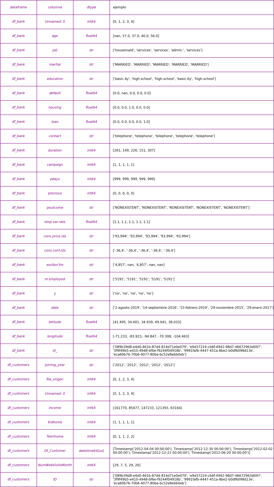

</div>


### Unión de ambos DataFrames para limpieza ###


Uso de Merge para crear una única fuente de datos y generar la limpieza.

El total de filas en el nuevo DataFrame:


- ***Total_bank_customer es: 43000***
- ***Se excluyen del analisis y de este merge 170 clientes*** existentes en  df_customers ( 0,4% del total),  clientes no han sido incluidos en la campaña de marketing.***

- ***Resumen del Dataset:***

    -Total Clientes Conocidos: 43,170.

    - Total Llamadas Realizadas: 43,000.

    - Total Clientes no contactados: 170 (se quedan fuera del análisis de marketing)
        Estos clientes pertencen a diferente año de afiliación, no guardan un patrón específico.
        (métodos: df.merge , .iloc[] , .nunique(), df[''].value_counts())

    - Dataset de trabajo: 43,000 filas.

- ***Proceso***:
    - Alineados al dataframe df_bank(método: pd.merge( ... how='left') para combinar ambos DataFrames.
    - Eliminación de columna duplicada ID, luego de validación de concordancia de Id's en las dos tablas. (método: .drop(columns=['ID']))


    - Las Columnas del nuevo DataFrame total_bank_customer:

        ['Unnamed: 0_x', 'age', 'job', 'marital', 'education', 'default', 'housing', 'loan', 'contact', 'duration', 'campaign', 'pdays', 'previous', 'poutcome', 'emp.var.rate', 'cons.price.idx', 'cons.conf.idx', 'euribor3m', 'nr.employed', 'y', 'date', 'latitude', 'longitude', 'id_', 'joining_year', 'Unnamed: 0_y', 'Income', 'Kidhome', 'Teenhome', 'Dt_Customer', 'NumWebVisitsMonth', 'id_equals_ID']

    - Todos los id son iguales, se puede eliminar la columna:
        "id_equals_ID".

    - Lista final de columnas del DataFrame total_bank_customer:

        ['Unnamed: 0_x', 'age', 'job', 'marital', 'education', 'default', 'housing', 'loan', 'contact', 'duration', 'campaign', 'pdays', 'previous', 'poutcome', 'emp.var.rate', 'cons.price.idx', 'cons.conf.idx', 'euribor3m', 'nr.employed', 'y', 'date', 'latitude', 'longitude', 'id_', 'joining_year', 'Unnamed: 0_y', 'Income', 'Kidhome', 'Teenhome', 'Dt_Customer', 'NumWebVisitsMonth']

### Limpieza de datos: df_total_bank_customer  ###

- A. Limpieza de data types y formatos 
    

    - a.1. Corrección de columnas económicas (de texto con comas a números decimales) (métodos: .astype(str) antes por si hay algún nulo que Python lea como float)

- B. Corrección de la columna 'date' a formato real.
    
    - Cambio simple de formato da un Warning porque el formato original es "2-Agosto-2019" y no "2-08-2019".
    
    - Aplicamos pasos intermedios para convertir los nombres de meses a números y luego convertir a datetime sin errores.

        - Creación de diccionario con:
            claves = meses lower, y valor= numero del mes con dos dígitos. 
        - Reemplazo de nombres en valores de columna 'date' en df_total_bank_customer  por números (método: df.str.lower)
        - Reemplazo nombres por su número (métodos: bucle for , .items , df[].str.replace() )
        - Aplicación de formatode  "2-08-2019" a date '%d-%m-%Y', usando coerce para que cualquier nulo o vacio sea 'NaN' y no de error. (método: pd.to_datetime(..... error='coerce'))


- C. Doble validación de 'Income'.

    Aseguramos que Income sea numérico, por si acaso en otro ordenador al cargar el dato no detecte el formato (método:pd.to_numeric(df[''],errors='coerce'))


- D. Verificación final de tipos  
    (método: dtypes)
        
    ```text
    --- NUEVOS DATATYPES ---
    cons.price.idx          float64
    cons.conf.idx           float64
    euribor3m               float64
    nr.employed             float64
    date              datetime64[us]
    Income                    int64
    dtype: object  


## 3. Limpieza de Nulos  ##
    
## *A. Evaluación de nulos en columnas de datos 'personales' y primera poda:*

- Limpias	        36091	No tienen ningún nulo en estas 4 columnas.
- Solo Age	        4820	tienen Nan solo en 'age'
- Solo "Otros"	    1789	Tienen la edad, podemos usar Chi-cuadrado para job o education.
- Mixtas (Críticas)	300	    No tienen edad ni tampoco alguno de los otros datos. Para descartar.  

   TOTAL	            43000

Conteo de nulos por fila en las columnas age, job, marital y education  

Total de filas con más de un NaN en age, job, marital o education: 423 de 43000 filas.

 De 43000 registros:  

- '> 1' Nan        423      0.9%
- 1 o sin Nan   42577     
- solo 1    6486     15.08%  
- Con Algun Nan 6909     16.07%  
- Con Nan en Age  +  algunas de estas 3 columnas ( job,marital o education): ..... 300 ... 0.69%  
- Con Nan en Age y >2 columnas  ( job,marital o education) con Nan: ..... 20 ... 0.04%  

*Siendo 300 filas las que tienen datos 'personales' incompletos que podrian afectar el total del análisis.*

        -Creamos columna : 'age_imputed' donde se identificará aquellas filas que tiene una edad calculada. 
        - 300 filas 'corruptas'tienen Nan en 'age' + 'job o marital o education': Almacenamos en DataFrama df_row_nandropped
        - La df_total_wipclean_ii tiene ahora : 42700 filas para empezar una segunda fase de Asignaciones a los Nan. 
   ***Proceso:***  
        Se realizó un análisis de calidad por fila.  
        Aquellos registros que presentaban más de 2 valores nulos en variable clave 'age' y otra de este grupo 'main'(job, marital, education) fueron catalogados como 'datos corruptos' y excluidos del dataset final de análisis (dataset df_rows_dropped), representando solo el 0.7% de la muestra total.  
    
***Para el resto de los nulos:***


- Variables Categóricas Independientes (marital, job): Son las que menos nulos tienen y no dependen de nadie. Imputamos con la Moda (el valor más frecuente) por grupo o global.  

- Variable Educativa (education): Al ser una variable que define mucho el perfil socioeconómico, suele tener relación con job. Se valida mediante Chi-cuadrado e imputa con las evidencias de este. 

- Para 'age' (variable numérica): se aplicó una imputación jerárquica basada en medianas por subgrupos.
            
Todas las celdas imputadas fueron marcadas con las columna booleanas:  

- is_imputed ... para imputaciones sobre 'age'
- other_mainimputed...para otras columnas (job, marital, education)
        
Permitiendo auditar el origen de los datos en cualquier fase del EDA.

## *B. Análisis e imputación dependencia entre 'marital', 'job' y 'education'.***

Para resolver la ausencia de datos en las variables principales, se evaluó la dependencia estadística entre las variables ocupación (`job`), estado civil (`marital`) y nivel educativo (`education`), estableciendo una estrategia de imputación robusta basada en la significancia práctica y teórica.

#### 1. Cuantificación del subconjunto de control
* **Registros identificados:** Se detectó un subconjunto inicial de 1.789 filas con valores faltantes en las columnas principales (`main_columns`).
* **Acciones operativas:** Se ejecutaron imputaciones directas sobre 371 filas. Dentro de este grupo impactado, se identificaron 119 registros que presentaban valores nulos simultáneos en la variable `education`.
* **Balance de control:** Tras la consolidación y cruce de las variables, el inventario neto de registros pendientes de resolución se estabilizó en 1.537 filas.

#### 2. Validación de hipótesis mediante el test de Chi-cuadrado
Con el objetivo de diseñar una estrategia de imputación eficiente para la variable `education`, se contrastaron las hipótesis de independencia frente a las variables operativas `job` y `marital`.

* **Prueba de hipótesis 1: Ocupación (`job`) vs. Nivel educativo (`education`)**
  * Hipótesis nula ($H_0$): El trabajo y el nivel educativo son independientes.
  * Hipótesis alternativa ($H_1$): Existe una asociación estadística entre el trabajo y el nivel educativo.
  * **Resultados del test:**
    * Estadístico Chi-cuadrado ($\chi^2$): $\approx 36.965,70$
    * Grados de libertad ($gl$): 60
    * Valor crítico ($\alpha = 0,05$): 79,08
    * p-valor: $p \approx 0$ (el estadístico supera el límite de precisión numérica del entorno de ejecución).

* **Prueba de hipótesis 2: Estado civil (`marital`) vs. Nivel educativo (`education`)**
  * Hipótesis nula ($H_0$): El estado civil y el nivel educativo son independientes.
  * Hipótesis alternativa ($H_1$): Existe una asociación estadística entre el estado civil y el nivel educativo.
  * **Resultados del test:**
    * Estadístico Chi-cuadrado ($\chi^2$): $\approx 1.768,92$
    * Grados de libertad ($gl$): 12
    * Valor crítico ($\alpha = 0,05$): 21,03
    * p-valor: $p \approx 0$

#### 3. Justificación y significancia práctica de negocio
Debido al gran tamaño de la muestra ($n \approx 43.000$), el test de Chi-cuadrado cuenta con una potencia estadística elevada, siendo habitual que ambas relaciones resulten estadísticamente significativas ($p < 0,05$). Por ello, el análisis se desplazó hacia la significancia práctica:

* La magnitud del estadístico para la variable `job` (36.965,70) es unas 20 veces superior a la obtenida por la variable `marital` (1.768,92), demostrando una capacidad explicativa radicalmente mayor sobre el nivel educativo.
* **Conclusión técnica:** Se descartó la variable `marital` del proceso de imputación para evitar una fragmentación excesiva del dataset, prevenir el sobreajuste y eludir la pérdida de soporte estadístico en los subgrupos.

#### 4. Implementación del selector jerárquico (Waterfall Imputation)

Para la asignación final de los valores faltantes en `education`, se desarrolló una lógica de salto jerárquico basada en el análisis de residuos estandarizados, buscando un equilibrio entre la especificidad de los perfiles profesionales y la robustez de la tendencia general:

* **Filtro de significancia por residuos:** Se estableció un umbral estricto donde solo se aceptaron las asociaciones con un residuo estandarizado $\ge 2$, garantizando que la moda imputada representara una relación estadística sólida y característica de cada ocupación.
* **Flujo de caída (Waterfall):**
  * **Nivel 1 (Especificidad):** Se calcula e imputa la moda del subgrupo específico determinado por la ocupación del cliente, siempre que la muestra cumpla con el umbral mínimo de soporte estadístico.
  * **Nivel 2 (Seguridad global):** Si el grupo profesional carece de volumen suficiente o la asociación no supera el filtro de residuos, el pipeline retrocede un paso y aplica de forma automática la moda global de la columna `education`, minimizando el ruido operativo y mitigando el riesgo de introducir sesgos artificiales en el dataset de producción.

***Conclusión técnica:***  
El trabajo (job) demuestra una capacidad explicativa muy superior al estado civil (marital) respecto al nivel educativo. Por ello, se decidió descartar marital del proceso de imputación, evitando la fragmentación excesiva del dataset y la pérdida de soporte estadístico.  

Para realizar esta imputación, se implementó un selector jerárquico que prioriza la especificidad de cada perfil profesional frente a la frecuencia general, apoyándose en un análisis de Residuos Estandarizados.  
 Tras identificar la educación más característica de cada ocupación, establecimos un umbral de significancia (Residuo $\ge 2$): solo las asociaciones que superaron este criterio fueron utilizadas para rellenar los datos faltantes; en casos donde la asociación no resultó estadísticamente sólida, se aplicó la moda global de education como medida de seguridad.  
  Este enfoque equilibra la precisión de los perfiles específicos con la robustez de la tendencia general, minimizando el ruido y el riesgo de sesgos en el dataset. 

**Mapa de calor de  Residuos estandarizados job & education(valores de celdas array )**


<div style="padding-left: 40px;">
    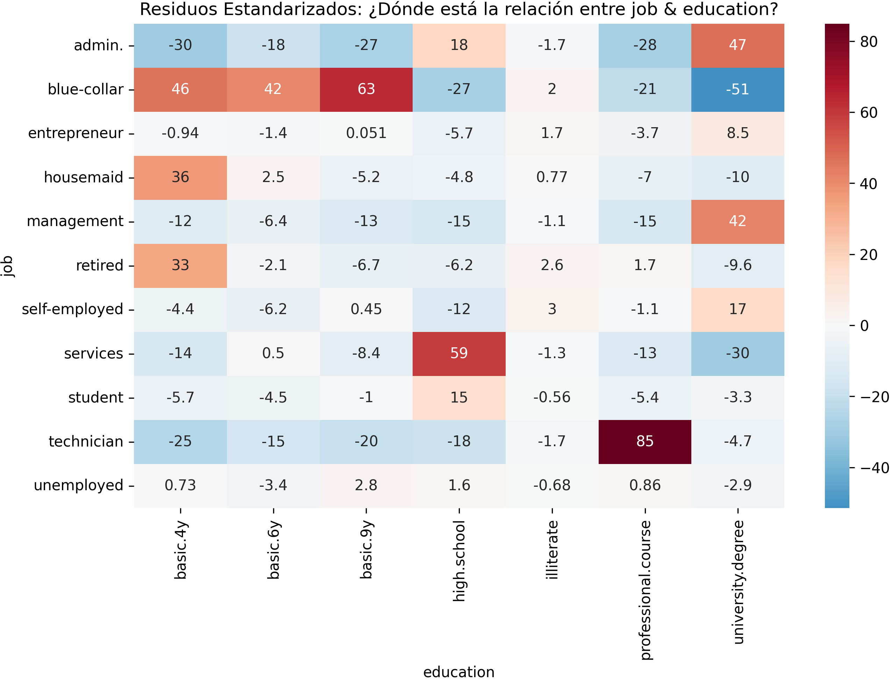
</div>  

<br>

## *C. Imputación de 'age'.*

Se realiza una imputación de 'age' en 4820 filas utilizando la media de medianas agrupadas, para evitar el efecto de los outliers  que sesgarían la media.  
Utilizamos un *n mayor igual a 20*  imputando la mediana general en aquellos casos cuyo subgrupo no cumple este criterio de soporte estadístico. 

- Total filas imputadas en 'age': 4820  
 --- Desglose ---
    - Imputadas con mediana de subgrupo (n >= 20): 4820
    - Imputadas con mediana global (fallback): 0

***Detección de outliers age***  

Visualizamos mediante boxplot las edades que se considerarian imposibles. 

 Observamos una mayor densidad de valores atípicos en el extremo superior (edades avanzadas), lo cual es coherente con la presencia de clientes jubilados.

Un 25 % de la muestra  tiene  menos de 33 años y el 75% es menor a 46 años. La muestra tiene 576 outliers representando un  1,3% de los datos. 

    Limite superior para outliers en 'age': 65.50 años
    Limite inferior para outliers en 'age': 13.50 años
    Total de registros con outliers en 'age': 576
    Porcentaje de outliers respecto al total: 1.35%

Sin embargo, tras una revisión cualitativa, se determinó que estos valores representan una variabilidad demográfica real (clientes en edades avanzadas) y no errores de captura de datos o ruido.   
Dado que el porcentaje de registros atípicos es bajo y posee valor informativo para el perfil de riesgo crediticio, se ha decidido mantenerlos íntegros, evitando sesgar la distribución real de la población analizada.

<div style="padding-left: 40px;">

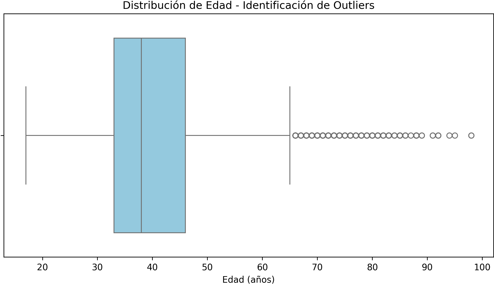

</div>

## *D.Limpieza de variables binarias categóricas*

Siendo estas las 3 variables

●  default - 20.88% nulos: Indica si el cliente tiene algún historial de incumplimiento de pagos (1: Sí, 0: No).
●  housing - 2.39% nulos: Indica si el cliente tiene un préstamo hipotecario (1: Sí, 0: No).
●  loan - 2.39% nulos: Indica si el cliente tiene algún otro tipo de préstamo (1: Sí, 0: No).

Se procede a asignar el valor de 'unknown' en base al analisis realizado.

**Análisis de las variables para decisión de asignación**

- **'default' 20.8%** -  8881 registros.:  

    Se detectó un 20% de valores faltantes en la variable default. Un análisis cruzado reveló que el 56.92% de estos registros cuenta con productos de crédito activos (housing o loan), descartando la hipótesis de que el vacío correspondiera a la ausencia de historial financiero.

    Ante la alta probabilidad de que el dato falte por motivos regulatorios o políticas de reporte (Missing Not At Random), se rechazó la imputación por moda para evitar un sesgo. En su lugar, se optó por formalizar la categoría 'unknown' como un atributo. Y tambien protege al modelo de clasificar erróneamente a clientes con riesgo potencial latente.

    ¿Algún producto de préstamo y con 'default' Nan?
      
    True     56.91%  
    False    43.08% 


- **'housing' or 'loan' 2.39%** -  1021 registros:

    Se opta por asignación de 'unknown' para el caso de housing or loan.
    Son 1021 lineas de data que coinciden  nulos en ambas columnas. 
    Las lineas contienen información de otras columnas, por lo que se descarta eliminarlas.  

    Se descarta la imputaciónd e la moda usando la moda de job para de housing y loan por separado, puesto que forzaría a miles de filas a adoptar exactamente el mismo patrón ficticio. 

    Si el banco no sabe si el cliente tiene un impago (default), es altamente probable que los datos de sus otros créditos en esa campaña también provengan de la misma fuente incompleta. Mantener el bloque financiero unificado como unknown cuenta una historia real sobre los datos.


## *D. Análisis, limpieza y asignación de variables de campaña y macroeconómicas (contexto)*

Siendo las variables divididas en estos dos grupos:
- **Variables de Campaña:** contact, duration, campaign, pdays, previous, poutcome.

- **Variables Macroeconómicas:** 'emp.var.rate', 'cons.price.idx', 'cons.conf.idx', 'euribor3m', 'nr.employed'.

Se aplica 'describe' para conocer datos de las variables numéricas antes de limpieza para elaborar estrategía. 


***Métricas de variables Macroeconómicas y de campaña***
<div style="padding-left:60px;">
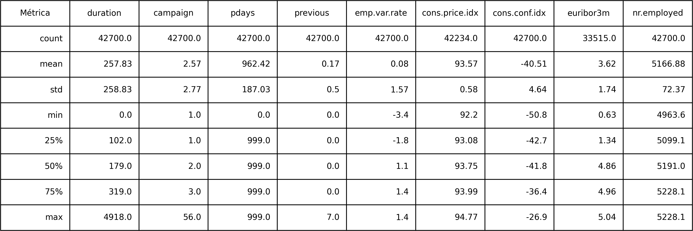

</div>
  
- **Observaciones**:
    - **campaign(veces contactados en esta campaña)** Mínimo han sido contactados 1 vez y más del 60% están entre 1-2 veces. siendo la media de 2,5. 
    Esto no es compatible con pdays '999' values.

    - **previous (veces contactados antes de esta campaña)**  al menos las tres cuartas partes del dataset son clientes completamente nuevos para el departamento de marketing.
    En campañas previas un 86% de todos los registros indican que no fueron contactados en campañas anteriores. 
    Y fueron contactados entre '1 y 2' veces  solo el 12,9%. 

    - **pdays( dias desde último contacto durante campaña)** '999' para los valores de percentil  25%, 50% , 75% y max indica que la mayoría de clientes no han sido contactados.  
    Al revisar los registros con 999 , sin embargo que tienen valores asignados mayores a cero en 'campaign' diferente a cero. observamos que este campo puede referirse a las campañas anteriores, más que a las campaña actual basándonos en las frecuencias evaluadas.

        Hipótesis A : tiempo desde último contacto en campaña actual implica que de existir 'numero de contactos actuales' (campaign>=1), pdays 999 ( nunca contactado) debe existir en un 0% de dichos registros. 

        Hipótesis B: pdays está vinculada exclusivamente al histórico de campañas de años anteriores. La proporción de 999 se mantendrá independiente de los datos de 'campaign' ( presente).

        - *En clientes con 1 solo contacto actual, el 999 representa el $95.45\%$ de la muestra.*
        - *En clientes sometidos a una alta insistencia comercial (de 6 a 10 contactos actuales), el 999 se mantiene inmóvil en un $98.66\%$.*
        - *En el extremo de acoso comercial (más de 10 contactos), el $99.89\%$ de los registros sigue reportando 999 días desde el último contacto.*
        - **Factor Concluyente: 'duration'**  
        *La presencia de interacciones reales confirmadas por la variable duration (donde el $50\%$ de los contactos superan los 3 minutos de conversación) confirma que el canal de comunicación estuvo activo. ***Por lo tanto, el predominio de 999 no implicaría una ausencia de llamadas, sino que el cliente no cuenta con antecedentes en bases de datos de ejercicios anteriores.***

    --- 
    &emsp;&emsp;***Distribución general de  'previous' & 'pdays'***
    <div style="padding-left:60px;">
    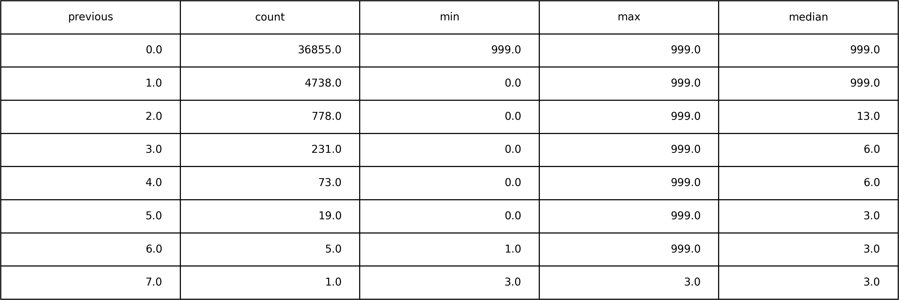
      </div>
      
    ---
    &emsp;&emsp;***Distribución general de  'campaign' & 'pdays'.***
    <div style="padding-left:60px;">
    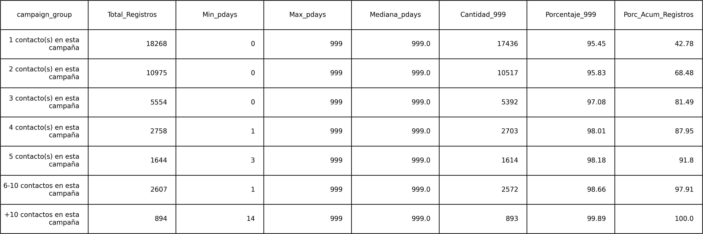

    </div>


    ---
    &emsp;&emsp;
    <div style="padding-left:60px;">
    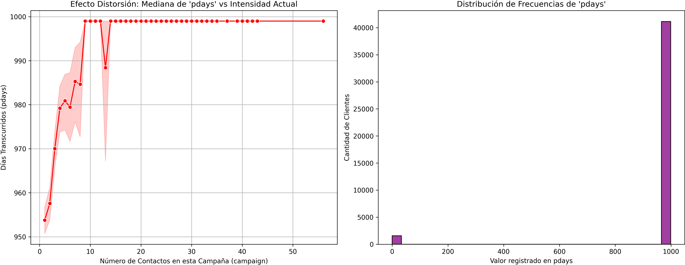
    </div>
    
    ---

    - **cons.price.idx (Índice de precios al consumo)** tiene 42,234 valores. con 466 nulos.

    - **euribor3m (La tasa de interés de referencia a tres meses)** 9185 regsitros sin datos. 

<br>

  
- **Outliers**:  
    * duration (duración de la llamada), el 75% de las llamadas dura 319 segundos (unos 5 minutos), pero el máximo es de 4,918 segundos (más de una hora y veinte minutos de llamada).
    * campaign (veces contactados) el 75% de la gente recibió 3 contactos o menos en esta campaña, pero hay alguien a quien llamaron 56 veces. Pudiendose considerar acoso comercial (outlier).


    
***Acciones***

- **Variables de Campaña**:  

    *pdays* : la media se ve alterada por el valor '999'.
    Mantener pdays como un número de 0 a 999 es confuso para el dataset, porque el 96% es ruido de código 999). Optamos por neutralizarlo.   
    
    1. Separamos Pasado de Presente:  
    Consideramos que la **campaña actual** tiene como referencia ***'duration' y 'campaign'.***

    2. Transformamos pdays en Flag: **'historical_contact_flag'**  
    En base a la hipotesis; Al estar tan ligada a si el cliente es nuevo o antiguo en el banco, eliminamos los 999 numéricos y creamos una variable categórica.
        -   'first_time_customer' : los que contienen 999
        -   'recurrent_customer'  : los que contienen algún valor  
        -   New distribution:'historical_contact_flag'  
            first_time_customer    96.0%  
            recurrent_customer      4.0%  

- **Variables de Macroeconómicas**:  

    euribor3m y cons_price_idx: Teniendo en cuenta que el  dataset viene ordenado cronológicamente por oleadas de llamadas, utilizaremos la técnica ffill (propagar el último valor válido hacia adelante) o bfill (traer el siguiente valor válido hacia atrás).

    Se detectó una ausencia de datos del $21.5\%$ en la variable euribor3m.  
    Puede deberse a :  
    - perdida aleatoria de conexión con la central que proporciona esos datos a la par de las llamadas.
    - o el lugar desde donde se realiza las llamadas genera una pérdida aleatoria.
    - naturaleza del mercado interbancario, el cual no genera cotizaciones en fines de semana o festivos comerciales donde el call center continuó operativo. - Se descarta este opción al realizar análisis agrupado por días de la semana.

         ---
    &emsp;&emsp;
    <div style="padding-left:60px;">
    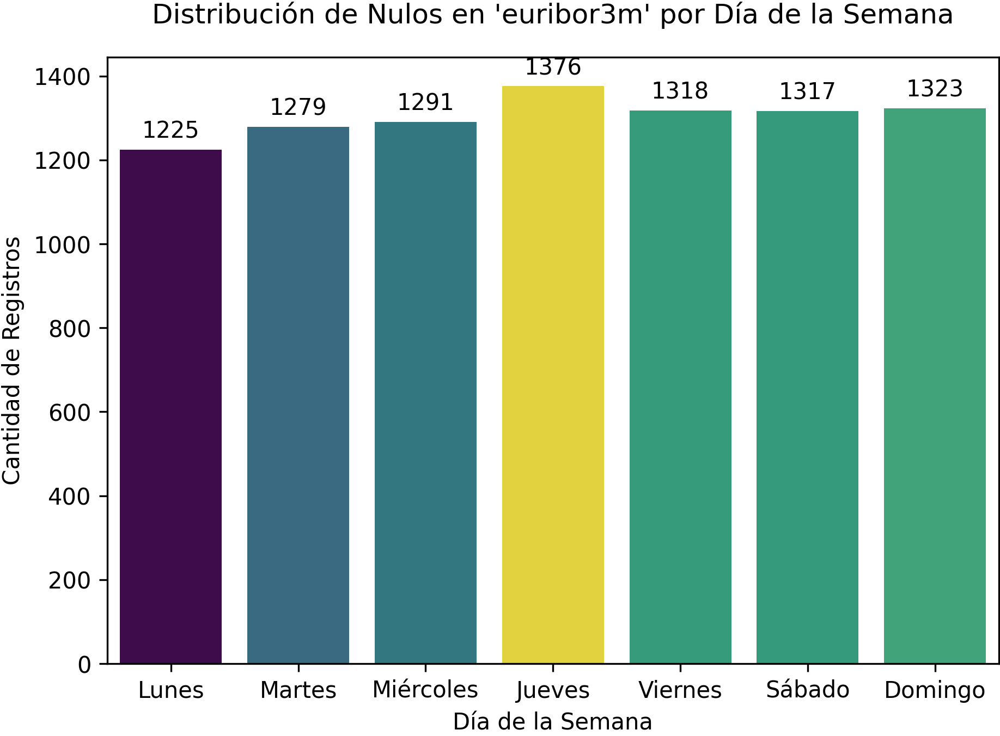
    </div>
    
        

    
    Aprovechando la presencia de la variable cronológica date en el $99.4\%$ del dataset:

    Total de registros con nulo en 'date': 247
    Total de registros con nulo en 'date' y 'euribor3m': 56
    Total de registros con nulo en 'date' pero con valor en 'euribor3m': 191 
    
    se rechazaron las imputaciones basadas en el perfil del cliente (moda o media) por inconsistencia.

    **Proceso imputación 'euribor3m' y 'cons.price.idx'**  
    En su lugar, se ordenó la matriz de manera cronológica y se decide  aplicar  (Forward/Backward Fill). Este método garantiza que las llamadas adopten las condiciones financieras del día bursátil más cercano.


    
    **El resumen de nulos antes de la imputación para contraste posterior:**

     
    Tamaño del DataFrame: (42700, 41)  
    Índice actual: Desde 0 hasta 42699  
    --------- ---- 
    Conteo de nulos listos para ser comparados posteriormente:  
    euribor3m         9185  
    cons.price.idx     466  
    ---- ----
    FILTRO A: Registros SIN FECHA y SIN EURIBOR3M  
    Total de registros encontrados en esta condición: 56


    | ID | orden_original | date | euribor3m | emp.var.rate | cons.conf.idx | nr.employed |
    | :--- | :---: | :---: | :---: | :---: | :---: | :---: |
    | **42460** | 1433 | *NaT* | *NaN* | 1.1 | -36.4 | 5191.0 |
    | **42463** | 2564 | *NaT* | *NaN* | 1.1 | -36.4 | 5191.0 |
    | **42469** | 3397 | *NaT* | *NaN* | 1.1 | -36.4 | 5191.0 |
    | **42477** | 5163 | *NaT* | *NaN* | 1.1 | -36.4 | 5191.0 |
    | **42485** | 6283 | *NaT* | *NaN* | 1.1 | -36.4 | 5191.0 |

    ----------- 

    FILTRO B: Registros SIN FECHA y SIN CONS.PRICE.IDX  
    Total de registros encontrados en esta condición: 4


    | ID | orden_original | date | cons.price.idx | emp.var.rate | cons.conf.idx | nr.employed |
    | :--- | :---: | :---: | :---: | :---: | :---: | :---: |
    | **42517** | 13212 | *NaT* | *NaN* | 1.4 | -42.7 | 5228.1 |
    | **42560** | 19256 | *NaT* | *NaN* | 1.4 | -36.1 | 5228.1 |
    | **42593** | 24602 | *NaT* | *NaN* | -0.1 | -42.0 | 5195.8 |
    | **42682** | 40358 | *NaT* | *NaN* | -1.7 | -38.3 | 4991.6 |

    **Observaciones e imputación 'euriborn' & 'cons.price.idx'**

    Diagnóstico del Filtro A (56 registros sin fecha ni Euríbor)
    En este grupo de ejemplo, todas las otras variables macroeconómicas de control están limpias y rellenas:
    Ejemplo:
    Su emp.var.rate en 1.1 (Tasa positiva alta).
    Su cons.conf.idx es de -36.4.
    Su nr.employed es idéntico en 5191.1 (empleo máximo).

    Pertenece al bloque económico de tipos máximos.
    Entendemos que el Euríbor real de ese momento histórico exacto (donde el empleo estaba al máximo y la tasa de variación era 1.1) se movía en el entorno  de 4.855 o 4.864 para el euriborn3m.

    Vemos que es muy estable el valor si se cuenta con la referencia de las otras variables macroeconomicas. 

    Diagnóstico del Filtro B (4 registros sin fecha ni IPC)
    En la captura de este grupo, vemos exactamente el mismo comportamiento en su entorno macro.

    **La Regla de Imputación**  
    Para los grupos que cuentan con fecha de referencia se realiza (Forward/Backward Fill). 

    Resto de nulos : Habiendo demostrado que el entorno macroeconómico es estables, podemos aplicar a las filas con Nan en dos grupos como date-consprice o date-euriborn  la mediana condicionada a ese subgrupo macroeconómico ( 'emp.var.rate', 'nr.employed').

    Es decir: a las filas vacías  aplicaremos la mediana de los registros reales que compartan sus mismas condiciones de mercado previamente incluidos en diccionario. 

    <br>


- **Resumen 'date'**:  
    Consideramos que 'date' es una estampa. Inventar un día, un mes o un año para esas 247 llamadas sería introducir "ruido" en el modelo.

    Mantenemos Nat en dichos registros. 

    <br>

### Resumen de la limpieza de  datos personales, campaña y financieros.  
Contamos con cero nulos luego de realizar asignaciones en los valores, utilizando métodos estadísticos.  
Mantenemos unicamente nulos en la columna de 'date'.  

El Dataframe con todas las limpiezas :  df_total_wipclean_ii se mantiene con sus columnas de apoyo para la limpieza para cualquier auditoría de datos, reordenándo únicamente en  base a index original y realizando reset index antes de guardar nueva copia del df. 

Columnas creadas - Nulos 

* is_imputed                      0
* nan_in_othermain_columns        0
* nan_age_andother                0
* other_mainimputed               0
* financial_profile_missing       0
* campaign_group                  0
* historical_contact_flag         0
* orden_original                  0
* euribor3m_original           9185
* cons.price.idx_original       466

Validamos una muestra de antes y despues del reordenamiento de las filas para asegurar que los datos no han sido modificados por el reorder o el fill. 

<div style="padding-left:60px;">
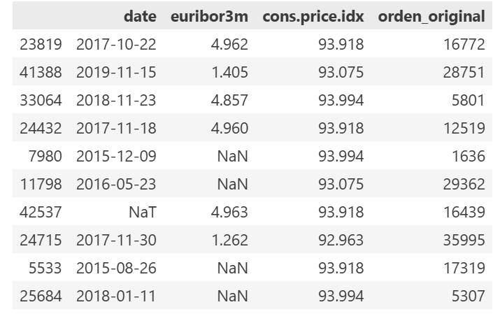
</div>

  
Después de la limpieza del bloque financiero y personal, para tener un punto de retorno seguro.

Creamos una copia con los resultados para continuar con siguiente bloque: 
***df_total_wipclean_iii = df_total_wipclean_ii.copy()***

<br>

## *E. Limpieza del Bloque Espacial (Geolocalización)* ##  

**Geolocalización:  'latitud' , 'longitud'**  

Creamos una limpieza de coordenadas en caso existan algunos valores imposibles 
fuera de los rangos de : Latitud: [-90, 90] | Longitud: [-180, 180] aplicando medianas.

Para el tratamiento de coordenadas geográficas imposibles optamos por aplicar una imputación basada en la Mediana (calculando la mediana de latitude y longitude por separado) en lugar de utilizar la media aritmética (mean()).

Si utilizáramos la media , un solo error de registro (por ejemplo, un cliente registrado erróneamente con latitud 90, en el Polo Norte) arrastraría el "centro" del banco cientos de kilómetros hacia arriba. 

La Mediana es eficiente para asignar un punto  realista sin generar un outlier artificial que pueda sesgar los pesos si se opta por el uso de Machine Learning en otra etapa. 


## *F. Limpieza de Outliers* ##

* ### 'age'

    Se mantienen los valores de edad de la data, tras análisis en la limpieza de esta variable. 

* ### 'duration' #
    Revisamos con técnicas de Normalización y Escalado (Z-Score) y analizamos la Distribución de Probabilidad de las llamadas.

    Tras aplicar ambas técnicas:

    **El IQR puede ser  demasiado estricto (3055 outliers):**

    El límite del IQR es 644.50 segundos ( 10.7 minutos).
    En el sector bancario, una llamada de 11 minutos podría considerarse normal ( porque te están explicando un producto). 
    No se desea asumir ese riesgo, a menos que el estudio lo requiera, ya que implicaría Borrar a 3000 clientes por hablar 11 minutos.
    Esto demuestra que duration no tiene una distribución simétrica, sino una larga cola hacia la derecha (Distribución Exponencial).


    **El Z-Score parece más adecuado** 

    Muestra la verdadera anomalía (889 outliers): Esos 889 registros son llamadas verdaderamente extremas (de > 40 minutos, 1 hora o puediendo ser casos donde se ha dejado una llamada descolgado, por plantear una hipotesis para los outliers más extremos).

    ✅ ¡Éxito! Imagen guardada en la raíz del proyecto:
    Ruta real: c:\Users\jovic\JCProjectsDA\JC_PythonData_EDA\proyecto-marketing-bancario\reports\figuras\Distribucion_Zscore_Duration.png


    <div style="padding-left:60px;">
    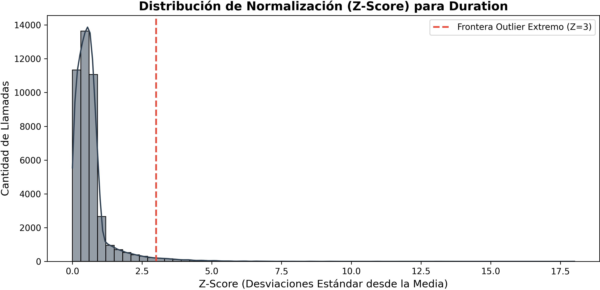
    </div>

    Se opta por : **WINSORIZACIÓN (CAPPING) por Z-SCORE**

    **Solución de Outliers en  'duration'**:  
    Al se una variable crucial para el análisis de campañas,
    #y que los outliers pueden distorsionar significativamente los resultados, optamos por una estrategia de normalización robusta en lugar de eliminación directa.

    Se han 'winsorizado' (limitado) 1411 llamadas extremas.  

    **Ejemplo de datos normalizados**

| ID | duration | duration_original | z_score_duration | is_duration_capped |
| :--- | :---: | :---: | :---: | :---: |
| **11061** | 881.08094 | 914.180635 | 3.156718 | **True** |
| **25996** | 881.08094 | 884.000000 | 3.013821 | **True** |
| **39635** | 881.08094 | 914.180635 | 3.156718 | **True** |
| **6174** | 881.08094 | 914.180635 | 3.156718 | **True** |
| **22895** | 881.08094 | 914.180635 | 3.156718 | **True** |


## 5. Diccionario de Columnas de Trazabilidad, Ingeniería y Auditoría

Para garantizar trazabilidad del dato, la reproducibilidad y la reversibilidad de las acciones de limpieza, se han conservado todas las variables auxiliares y de respaldo generadas durante la fase de limpieza y estructuración de la data.

A continuación se detalla el propósito técnico y estadístico de cada una de estas columnas operativas:

#### 1. Arquitectura de Índices y Trazabilidad Absoluta
| Columna | Tipo de Dato | Descripción / Propósito Estadístico |
| :--- | :--- | :--- |
| **`index_merge_original`** | `int64` | **El "DNI" absoluto del registro.** Conserva el índice nativo de la fila inmediatamente después del *merge* inicial de los 43.000 registros, permitiendo rastrear el origen antes de la purga. |
| **`orden_original`** | `int64` | **Ancla operacional.** Creada tras eliminar los registros nulos estructurales. Funciona como el índice base (sin huecos) para devolver el *dataset* a su alineación natural tras ordenamientos cronológicos. |
| **`fila_origen`** | `int64` | **Trazabilidad de extracción.** Identificador de la ubicación original del registro en los ficheros en bruto (raw data). |

#### 2. Validación Demográfica y de Perfil
| Columna | Tipo de Dato | Descripción / Propósito Estadístico |
| :--- | :--- | :--- |
| **`nan_in_othermain_columns`** | `bool` | **Control de calidad.** Identifica registros que presentaban valores nulos en al menos una de las variables categóricas principales (`job`, `marital`, `education`). |
| **`nan_age_andother`** | `bool` | **Filtro de purga estructural.** Marca registros críticamente incompletos (nulo en `age` + nulo en otras principales). Usado para la eliminación inicial de datos irrecuperables. |
| **`is_imputed`** | `bool` | **Bandera de imputación continua.** Indica (`True`) si la edad (`age`) fue estimada mediante la mediana contextual o global. |
| **`other_mainimputed`** | `bool` | **Bandera de imputación categórica.** Señala los registros donde `marital` o `job` fueron rellenados estadísticamente usando la moda. |
| **`financial_profile_missing`**| `bool` | **Auditoría de riesgo.** Marca registros con ausencia de datos en el bloque de solvencia (housing, loan, default). |

#### 3. Validación Macroeconómica (Imputación Temporal)
| Columna | Tipo de Dato | Descripción / Propósito Estadístico |
| :--- | :--- | :--- |
| **`euribor3m_original`** | `float64`| **Respaldo macroeconómico.** Valor crudo del Euribor a 3 meses antes de aplicar la imputación cronológica (Forward/Backward fill) y la vectorial basada en contexto de empleo. |
| **`cons.price.idx_original`** | `float64`| **Respaldo de inflación.** Valor crudo del Índice de Precios al Consumidor antes del saneamiento temporal. |

#### 4. Validación Espacial
| Columna | Tipo de Dato | Descripción / Propósito Estadístico |
| :--- | :--- | :--- |
| **`is_geo_imputed`** | `bool` | **Bandera de control espacial.** Indica si las coordenadas (`latitude`, `longitude`) eran nulas o imposibles y requirieron corrección hacia la Mediana Marginal (epicentro de clientes). |

#### 5. Detección de Anomalías y Tratamiento de atípicos (Winsorización -Capping)
| Columna | Tipo de Dato | Descripción / Propósito Estadístico |
| :--- | :--- | :--- |
| **`duration_original`** | `float64`| **Respaldo del dato crudo.** Almacena el tiempo real e intacto de la duración de la llamada telefónica, garantizando la reversibilidad del tope estadístico. |
| **`z_score_duration`** | `float64`| **Métrica de normalización.** Cálculo matemático de a cuántas desviaciones estándar de la media se encuentra la duración original de cada llamada (`z = abs(x - mu) / sigma`). |
| **`is_duration_capped`** | `bool` | **Bandera de Winsorización.** Marca a los registros atípicos extremos (`z_score_duration` > 3) cuya variable operativa `duration` fue limitada al tope estadístico superior para proteger futuros modelos predictivos. |

#### 6. Variables Derivadas
| Columna | Tipo de Dato | Descripción / Propósito Estadístico |
| :--- | :--- | :--- |
| **`campaign_group`** | `str` | **Agrupación analítica.** Categorización derivada de la variable `campaign` para simplificar la lectura de la intensidad de los contactos comerciales. |
| **`historical_contact_flag`** | `str` | **Segmentación de histórico.** Variable de estado binario/categórico que clasifica si el cliente ha sido contactado en campañas previas. |

## 6. Arquitectura de Datos: Pipeline ETL en 3 Capas ##

Para garantizar la integridad, trazabilidad y escalabilidad del proyecto, el flujo de datos (Extracción , transformación y carga) se ha diseñado utilizando un modelo clásico de capas. Esto asegura que el dato original nunca se destruya y que cada fase de transformación sea auditable.

El ecosistema convive en dos entornos simultáneos: almacenamiento físico en ficheros (para portabilidad) y almacenamiento relacional en bases de datos SQL (para consultas analíticas).

###  1. Capa inicial (Raw Layer)
Contiene los datos brutos e inmutables, tal cual fueron extraídos de los sistemas de origen. Es la fuente inicial.
* **Archivos Físicos:** Ficheros CSV originales alojados en el directorio `data/raw/`.
* **Tablas SQL:** `raw_bank` y `raw_customers`.
* **Detalle técnico:** No se aplica ninguna transformación en esta capa. Si ocurre un fallo crítico en el pipeline, el sistema siempre se puede reiniciar leyendo desde aquí.

###  2. Capa de Integración (Staging Layer)
Representa la primera consolidación del modelo de datos. Aquí se realiza el cruce (*merge*) de las distintas fuentes, unificando la información de los clientes bajo un mismo identificador.
* **Archivos Físicos:** No aplicable (se evita la redundancia en disco).
* **Tablas SQL:** `stg_total_bank_customer`.
* **Detalle técnico:** En esta fase, los datos ya están unidos, pero **conservan todos sus errores estructurales** (valores nulos, atípicos extremos, desalineaciones). Esta capa es vital para los procesos de auditoría, ya que permite ver el estado exacto del dato justo antes de inyectar reglas matemáticas de negocio.

###  3. Capa de Producción (Cleaned / Production Layer)
Es el activo de datos final, refinado y enriquecido. Los datos han pasado por procesos de imputación macroeconómica, saneamiento espacial, winsorización de *outliers* y *Feature Engineering*. 
* **Archivos Físicos:** Copia de seguridad exportada en `data/processed/dataset_marketing_cleaned_v1.csv`.
* **Tablas SQL:** `prd_marketing_cleaned`.
* **Detalle técnico:** Se ha implementado una estrategia de **Doble Persistencia** (Fichero + Base de Datos). Esta tabla está optimizada para ser consumida directamente por algoritmos de *Machine Learning* o herramientas de *Business Intelligence* (BI). Además, conserva un diccionario completo de columnas de trazabilidad (ej. `is_imputed`, `orden_original`, `is_duration_capped`) que explican qué le ocurrió a cada celda durante la limpieza.

<br>

## 7. Análisis Exploratorio de Datos (EDA) y Verificación de Suposiciones de Negocio #

Objetivo del Informe 

Este documento tiene como finalidad comprender el comportamiento de los clientes del banco frente a la campaña de depósitos a plazo, identificando patrones subyacentes, validando hipótesis de negocio (Verificación de Suposiciones) y analizando el impacto de variables demográficas y macroeconómicas, sin recurrir a modelos predictivos.

## Identificación de Patrones (Tendencias y Distribuciones) ##

De acuerdo con la metodología EDA, comenzaremos analizando las tendencias generales y la forma de nuestros datos.

- Configuración del Entorno: Carga de prd_marketing_cleaned y definición de la paleta de colores corporativa (Verde/Rojo para el éxito de campaña).

- Distribución del Target (y): Gráfico de barras para visualizar el desbalanceo de clases (tasa de conversión global).

- Distribuciones Demográficas (Histogramas/KDE): Análisis de la forma de las variables age e Income. ¿Tenemos distribuciones normales, asimétricas o multimodales?

- Patrones Categóricos: Identificación del volumen de clientes por job, marital y education.

**Distribución del Target (y)**
El análisis univariante revela una distribución altamente asimétrica en la variable objetivo (y). Aproximadamente el 89% de los clientes contactados rechazaron la oferta ("no"), frente a un escaso 11% de conversión ("yes"). Este es un patrón estructural clave que confirma la dificultad de la campaña comercial y nos indica que debemos perfilar muy bien a esa minoría del 11% en las siguientes fases para entender qué les hizo decir que sí.

La distribución de la variable objetivo es :

| Respuesta (y) | Porcentaje (%) |
| :--- | :---: |
| **no** | 88.74% |
| **yes** | 11.26% |


&emsp;&emsp;
<div style="padding-left:60px;">
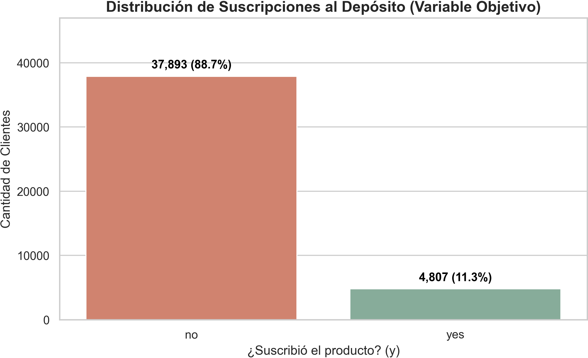
</div>


### Patrones generales: Distribuciones demográficas (edad e ingresos) ###

Distribuciones Demográficas (Histogramas/KDE): Análisis de la forma de las variables age e Income. ¿Tenemos distribuciones normales, asimétricas o multimodales?

Identificación de patrones: Distribuciones demográficas

- Edad (age): Observamos una distribución ligeramente asimétrica hacia la derecha. El núcleo principal de nuestra base de datos se concentra entre los 32 y los 47 años, con una media cercana a los 40 años. Las caídas en los extremos indican que tenemos poca penetración en perfiles muy jóvenes (menores de 25) y en la tercera edad.

- Ingresos (Income): La distribución presenta una forma que se aproxima a la normalidad en su campana central, aunque con una ligera cola hacia la derecha (asimetría positiva), reflejando que la mayoría de los clientes se agrupan en tramos de ingresos medios, mientras que una minoría alcanza los rangos más altos.


&emsp;&emsp;
<div style="padding-left:60px;">
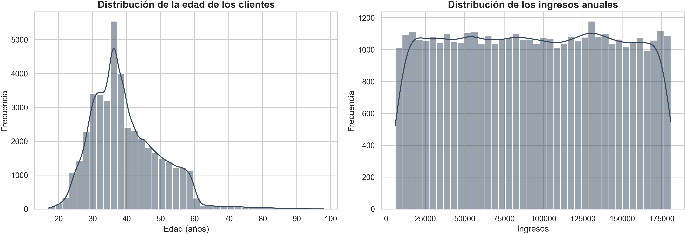
</div>

### Patrones Categóricos: Identificación del volumen de clientes por job, marital y education. 

Al analizar las variables categóricas principales, el patrón estructural de la base de clientes queda claramente definido:

- Profesión: Existe una fuerte concentración en sectores administrativos (admin.), obreros/cuello azul (blue-collar) y técnicos (technician). Estos tres grupos componen el grueso de nuestra cartera objetivo, lo que indica un perfil de cliente de clase trabajadora y media.

- Estado civil: La inmensa mayoría de los clientes están casados (married), seguidos a bastante distancia por los solteros (single). Esto, cruzado con la media de edad (40 años), nos dibuja a un cliente tipo en fase de consolidación familiar, lo cual es fundamental para entender su aversión al riesgo a la hora de contratar depósitos.
  
  
--- Top 3 profesiones en la base de datos ---  
Porcentaje (%) 
* admin.	26.1  
* blue-collar	22.4  
* technician	16.4  

&emsp;&emsp;
<div style="padding-left:60px;">
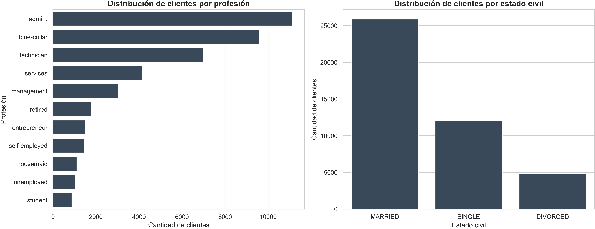
</div>


## Identificación de Anomalías y Contexto ##
Validación visual de las decisiones tomadas durante el limpieza y análisis de valores extremos válidos.

**'duration'**
 
El impacto de la llamada (duration): 

Anomalías en la interacción (duration): El análisis de cajas (boxplot) de la duración original revelaba una distorsión crítica: llamadas que superaban los 4.000 segundos (más de una hora), extendiendo la cola derecha de forma antinatural. Estas anomalías, probablemente operativas, alteraban la varianza.  
 El segundo gráfico demuestra el éxito de la Winsorización (Z=3), conteniendo los valores extremos dentro de un límite realista (aprox. 1.000 segundos) sin eliminar la valiosa señal de esas interacciones largas.

&emsp;&emsp;
<div style="padding-left:60px;">
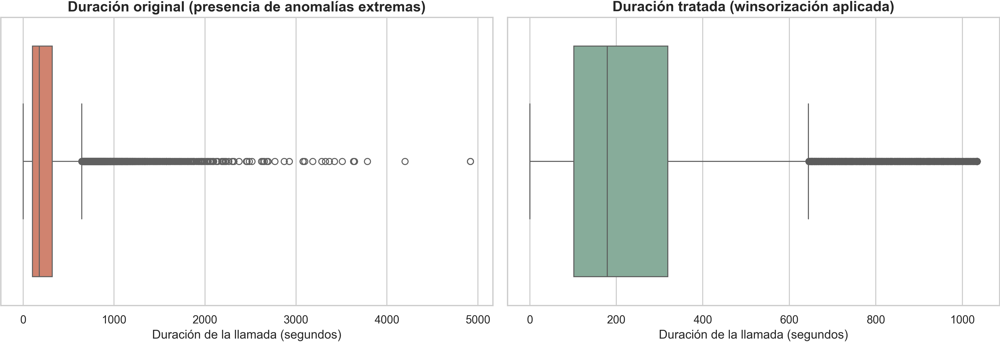
</div>

**Contexto Macroeconómico** 

Contexto macroeconómico: El gráfico de dispersión revela un claro patrón de agrupación (clustering natural) en los indicadores externos. La tasa de empleo y el Euribor no se distribuyen de forma aleatoria, sino que forman bloques densos y escalonados. Esto nos indica que las campañas se lanzaron en "ventanas temporales" económicas muy concretas y polarizadas (momentos de tasas altas vs. tasas bajas).

&emsp;&emsp;
<div style="padding-left:60px;">
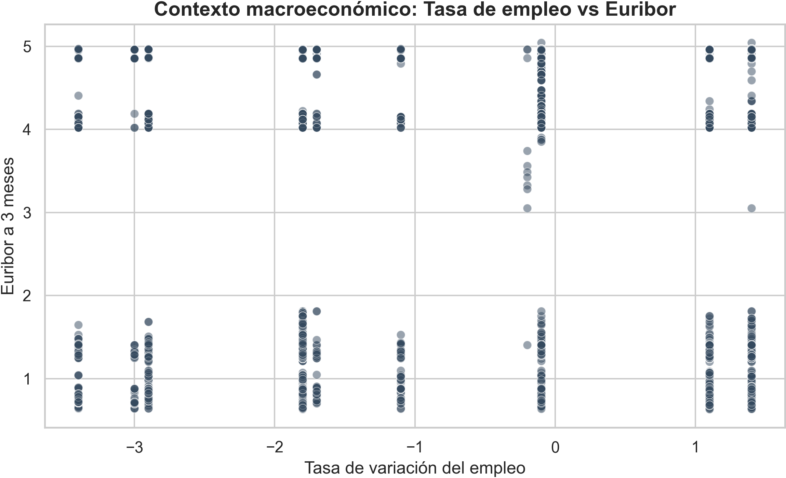
</div>


## Verificación de Suposiciones Demográficas- Profesional  (El Núcleo del Negocio) ##
Se evalua en dos bloques: 
- el perfil demográfico/profesional (quién conforma ese 11% de éxito) 
- el perfil de carga familiar (si tener hijos influye en la decisión).

### Verificación de suposiciones: El factor generacional (Edad vs Suscripción)

Superponemos la distribución de los rechazos y los éxitos en las suscripciónes según edad. 


Las medianas de edad de ambos grupos se sitúan de forma casi idéntica (38 años para el rechazo y 37 años para el éxito), compartiendo un pico de volumen central en el tramo de los 35 a 45 años debido al diseño de muestreo del banco. Sin embargo, el análisis del comportamiento relativo de las curvas revela dos ventajas competitivas evidentes en las colas de la distribución.

 **Comportamiento en las colas de la distribución:**
1. **Segmento joven (<28 años):** La curva de éxito (`yes`) se posiciona  por encima de la curva de rechazo (`no`). Dentro de su volumen de llamadas, los perfiles jóvenes muestran mayor receptividad a la media de la campaña.
2. **Segmento senior (>60 años):** Se observa el patrón más nítido de toda la distribución. A partir de la edad de jubilación, la curva de rechazo se deprime por completo mientras que la curva verde de éxito genera una meseta extendida de alta probabilidad.

**Explicación y justificación de negocio:**  
 El tramo central de la pirámide (32-58 años) concentra la masa crítica de llamadas pero sufre una penalización de rechazo (dominio de la curva terracota).  
 Esto se debe a que la población activa cuenta con menor tiempo de atención telefónica y mayores cargas financieras vivas (hipotecas, préstamos activos). 

 En contraste, los márgenes demográficos (juventud y jubilación) disponen de mayor apertura para escuchar la propuesta. El esfuerzo de saneamiento aplicado sobre esta variable queda plenamente justificado al descubrir que la edad es uno de los predictores cualitativos más potentes de la campaña.
  
| Grupo de Edad (age_group) | Conversión (y = yes) |
| :--- | :---: |
| **<25 jóvenes** | 21.4% |
| **25-30 junior** | 13.2% |
| **31-45 maduros** | 9.6% |
| **46-60 senior** | 9.9% |
| **>60 jubilación** | 44.8% |

&emsp;&emsp;
<div style="padding-left:60px;">
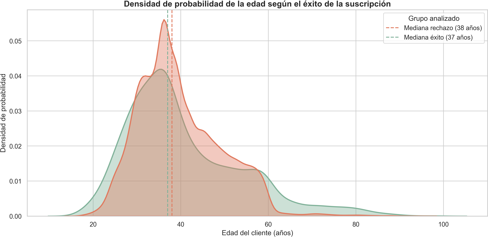
</div>


### Verificación de suposiciones: Carga familiar con porcentajes

Los datos desmienten parcialmente la suposición inicial. Los hogares sin hijos (0) no muestran una ventaja masiva en conversión frente a los que tienen 1 o 2 hijos, manteniéndose todos en ratios estables cercanos al 10-11%. La carga familiar no actúa como un freno crítico para este producto financiero en específico.

&emsp;&emsp;
<div style="padding-left:60px;">
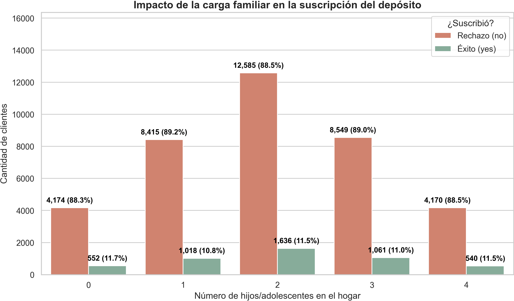
</div>


### Verificación de suposiciones: Profesión vs Suscripción (Con porcentajes)
Aunque los sectores administrativos (admin.) y obreros (blue-collar) son los más contactados en volumen, la tasa porcentual de éxito revela un patrón oculto. Los estudiantes (student) y los jubilados (retired) presentan las tasas de conversión más altas de todo el portafolio, superando significativamente la media general del 11.3%. 

El negocio podría poner énfasis en cubrir estos dos nichos.  debe reorientar el esfuerzo comercial hacia estos nichos con mayor liquidez o tiempo disponible

&emsp;&emsp;
<div style="padding-left:60px;">
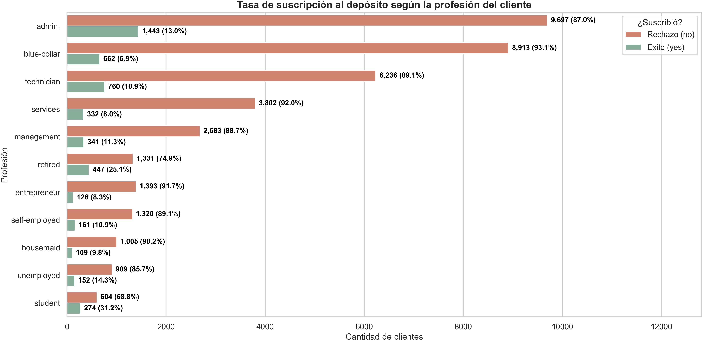
</div>

### Verificación de hipótesis complementaria: Duración media por profesión 

Hipótesis : "convierten más los estudiantes y jubilados, porque atienden más tiempo la llamada"), ¡vamos a comprobar si los datos te dan la razón de inmediato!

Cruzamos en el siguiente bloque de código la profesión con la mediana de duración de la llamada para ver si estudiantes y jubilados son efectivamente los que más tiempo se quedan al teléfono.

Vemos que los estudiantes (student) y jubilados (retired) están, efectivamente, en el top 3 de los que mantienen llamadas más largas (con medianas de 216 y 201 segundos, respectivamente).  

Esto confirma  hipótesis sobre la "predisposición a escuchar" es un factor real.  

Asi mismo revisamos si : 
- "Insistir demasiado funciona o satura al cliente": número de contactos divisdidos por tasas de éxito o rechazo 
- "donde se está poniendo el esfuerzo y si da frutos": número de contactos por cada profesión. 

&emsp;&emsp;
<div style="padding-left:60px;">
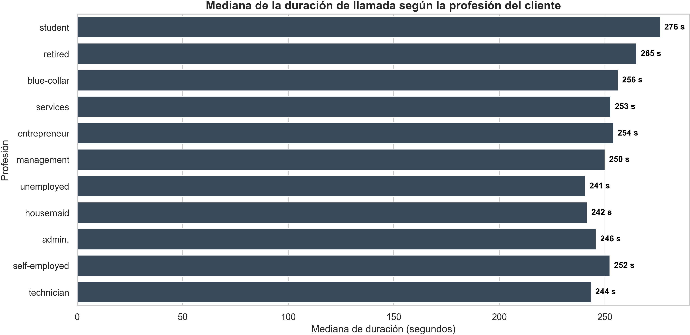
</div>


### Verificación de hipótesis complementaria: Impacto del número de contactos (campaign) ###

Añadimos la variable campaign (número de contactos o llamadas realizadas a un mismo cliente durante la campaña), y cruzarla con el éxito para verificar si ¿Insistir demasiado funciona, o llega un punto en que saturamos al cliente y la conversión cae?

Agrupamos los datos por la variable campaign y calcular qué porcentaje de éxito (yes) se logra en la primera llamada, en la segunda, en la tercera, etc., para ver el comportamiento de los grupos.

Eficiencia del esfuerzo comercial (campaign): 
La ley de los rendimientos decrecientes: Los datos revelan que la mayor efectividad se logra en el primer contacto (contacto 1), registrando la tasa de conversión más alta de la campaña. En el segundo contacto la tasa disminuye, y a partir del tercero o cuarto, la probabilidad de éxito cae a niveles mínimos, convirtiéndose en un esfuerzo comercial ineficiente.

&emsp;&emsp;
<div style="padding-left:60px;">
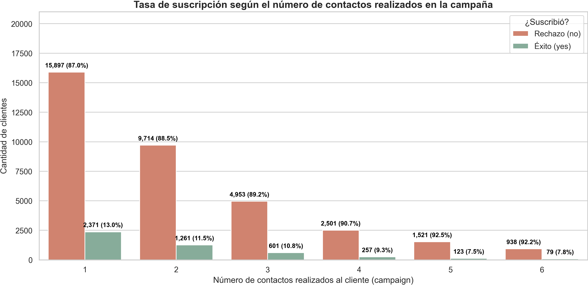
</div>

### Verificación de hipótesis complementaria: operativo-demográfica: Contactos por profesión ###

Si los estudiantes y los jubilados tienen una tasa de éxito tan alta, necesitamos comprobar si el equipo comercial ya se había dado cuenta de esto y los infló a llamadas (campaign), o si por el contrario a otros grupos los llamaron más veces de la cuenta, perdiendo tiempo y dinero.

Para cruzar la profesión con la media del número de llamadas, generamos un gráfico de barras que muestre exactamente el promedio de intentos que se llevó cada grupo.

Al analizar la media de intentos, se observa un patrón de fatiga comercial. 

Los grupos a los que más veces se les llamó de media (muchas veces rozando o superando las 2.5 o 3 llamadas promedio por cliente) suelen coincidir con sectores activos laboralmente (como emprendedores o trabajadores de cuello azul), cuyas tasas de conversión vimos que eran de las más bajas (aprox. 7%).

Por el contrario, los estudiantes y jubilados —que han demostrado ser los perfiles rentables por su alta conversión y disponibilidad para escuchar— se encuentran en la parte baja o media del histórico de insistencia.

El banco ha estado sobre-contactando al cliente difícil e infra-contactando al cliente receptivo. Corregir este desajuste en el reparto de llamadas podría optimizar el coste por adquisición de forma inmediata.
Revisar la estrategia para llegar a los 'sectores activos', que cuentan con menor tiempo de escucha , o revisar los horarios en los que se contacta con ellos podría cambiar la tendencia de 'rechazos' de este sector. 

&emsp;&emsp;
<div style="padding-left:60px;">
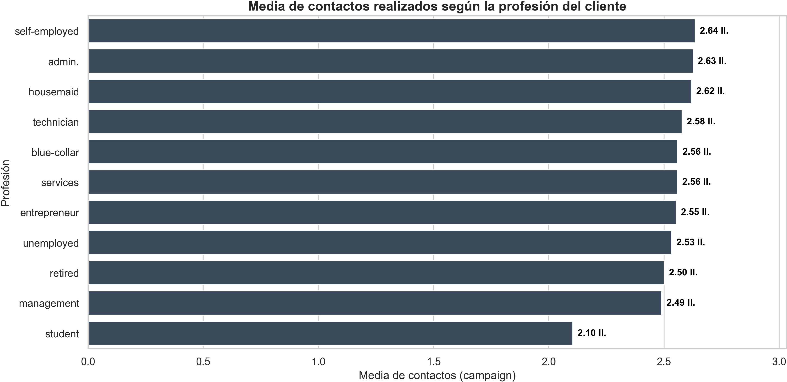
</div>

## Verificación de suposiciones: Impacto del Euribor en la suscripción ##
Validación de  si los clientes apostaron  por los depósitos cuando el Euribor estaba por las nubes (cerca del 5%) para asegurar rentabilidad, o si reaccionaron mejor en entornos de tipos bajos.s

| Entorno económico | Tasa de éxito / Conversión (yes) |
| :--- | :---: |
| **Tipos bajos (Euribor < 2%)** | 21.7% |
| **Tipos altos (Euribor >= 4%)** | 6.1% |

&emsp;&emsp;
<div style="padding-left:60px;">
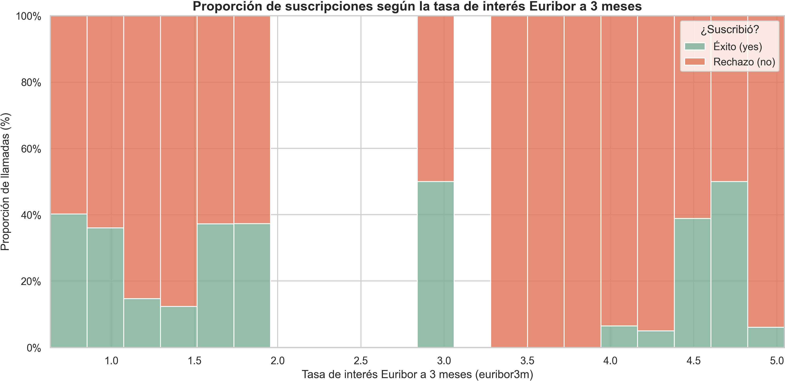
</div>

Contrario a la creencia lógica de negocio de que "un Euribor alto incentiva la contratación por ofrecer rentabilidades atractivas", los datos demuestran un patrón radicalmente opuesto. En entornos de tipos bajos (Euribor < 2%), la tasa de éxito de la campaña se dispara exponencialmente. Por el contrario, en entornos de tipos altos (Euribor >= 4%), el porcentaje de éxito se desploma de forma severa.

En periodos de Euribor alto (asociados habitualmente a tensiones financieras o inflación alta), el cliente particular prefiere mantener su dinero disponible (liquidez inmediata) ante la incertidumbre o tiene un coste de oportunidad mayor (otras deudas que pagar). 
En cambio, en periodos de tipos de interés deprimidos, el cliente tradicional busca de manera activa cualquier producto financiero alternativo, como estos depósitos a plazo fijo, para conseguir algun  rendimiento que su cuenta corriente habitual ya no le ofrece.


# *Conclusiones ejecutivas y recomendaciones estratégicas* 

Tras completar el Análisis Exploratorio de Datos (EDA) aplicado sobre las tres capas de información de la campaña (demográfica, operativa y macroeconómica), se presentan las siguientes conclusiones con la evidencia de los datos para la toma de decisiones:

###  1. El diagnóstico de conversión y desbalanceo
La campaña comercial presenta una tasa de conversión global del **11.3%** (4.807 suscripciones exitosas frente a 37.893 rechazos). Este marcado desbalanceo confirma la alta fricción del producto y la necesidad imperiosa de optimizar la asignación del esfuerzo de telemarketing hacia perfiles eficientes para reducir costes operativos.

### 2. Ventaja competitiva en los márgenes demográficos (`age`)
El análisis bivariante mediante curvas de densidad de probabilidad desmiente una relación lineal simple entre la edad y la compra del producto, revelando un comportamiento diferencial en los extremos de la distribución:
* **El terreno hostil central:** El tramo medio de la pirámide demográfica (32 a 58 años) concentra el mayor volumen absoluto de llamadas del banco, pero está dominado sistemáticamente por el rechazo. Este segmento coincide con la población activa con menor disponibilidad de tiempo y mayores compromisos financieros de amortización (como préstamos e hipotecas).
* **Las ventanas de oportunidad:** El éxito comercial le gana terreno al rechazo de forma visible en dos zonas específicas: los menores de 28 años y, de manera masiva, los mayores de 60 años. Estos perfiles, asociados a menores cargas familiares complejas o a una fase de desacumulación y ahorro conservador, muestran una predisposición natural muy superior para contratar el depósito a plazo fijo.

### 3. Paradoja del volumen frente a la eficiencia (Profesiones)
* **Los pilares de volumen:** Los sectores administrativos (`admin.`) y técnicos sostienen el negocio en términos absolutos (aportando el mayor número de contratos netos debido al gran tamaño de su muestra en la cartera).
* **Los nichos de alta eficiencia:** Los estudiantes (`student`, **31.2%** de éxito) y jubilados (`retired`, **25.1%** de éxito) duplican y triplican la media de conversión general, revelando un patrón de receptividad oculto.

###  4. La hipótesis del tiempo de escucha y predisposición
Los datos visuales confirman la hipótesis de comportamiento:  
Los estudiantes y jubilados registran las medianas de duración de llamada más altas de todo el histórico del banco (**276 y 265 segundos**, respectivamente). Existe una relación directa entre la disponibilidad de tiempo de estos segmentos para mantener una escucha activa de la propuesta comercial y la decisión final de suscripción.

### 5. Ineficiencia en el reparto del esfuerzo comercial (`campaign`)📉
* **Asignación desajustada:** El banco ha estado sobre-contactando al cliente difícil e infra-contactando al cliente receptivo. Los perfiles con menor tasa de éxito (como los trabajadores autónomos o `self-employed`, con un 10.9% de éxito) registran la media de intentos más elevada de la campaña (**2.64 llamadas** de media por cliente). Por el contrario, los estudiantes —el nicho más receptivos, aunque con una población más pequeña, con un 31.2% de conversión— se encuentran en el último lugar de insistencia con apenas **2.10 llamadas** promedio.
* **La ley de rendimientos decrecientes:** El análisis de la variable `campaign` demuestra que la efectividad se concentra drásticamente en el primer contacto (**13.0%** de conversión con 2,371 éxitos). En la segunda llamada la efectividad cae al **11.5%**, y a partir del cuarto intento la probabilidad se desploma por debajo del **9.3%**, volviendo el proceso comercial ineficiente en términos de coste-tiempo.

### 6. Reformulación estratégica para los sectores activos y cuantificación del riesgo 🏢 
Los perfiles laboralmente activos concentran el grueso absoluto de la base de datos de la campaña. Al agrupar los sectores de administración (`admin.`), operarios (`blue-collar`) y técnicos (`technician`), sumamos una masa crítica de **27.711 clientes**, lo que representa el **64.9% del volumen total de la cartera** contactada.

Sin embargo, estos segmentos muestran tasas de rechazo extremadamente elevadas (destacando el sector `blue-collar` con un **93.1%** de rechazo y el sector `technician` con un **89.1%**), asociadas directamente a medianas de tiempo de llamada muy cortas en comparación con los nichos inactivos. Esto indica que la estrategia comercial actual falla por un problema crítico de oportunidad y adaptabilidad:

* **El riesgo de la fatiga operativa:** Al destinar casi el 65% de todo el esfuerzo e infraestructura de llamadas a perfiles que sistemáticamente cuelgan rápido debido a la falta de tiempo dentro de su horario laboral convencional, el banco incurre en un coste de oportunidad masivo y destruye el valor de su base de datos por saturación.
* **Falta de tiempo disponible:** Estos clientes activos cuentan con ventanas temporales muy reducidas para atender, procesar y analizar ofertas financieras complejas (como un bloqueo de capital a plazo fijo), lo que genera un rechazo inmediato por pura fricción del canal telefónico.

* **Acción sugerida:** Se recomienda de manera urgente reformular la aproximación a este 64.9% del negocio mediante dos vías operativas:
  1. **Flexibilidad horaria:** Revisar y desplazar los horarios de marcado automatizado para estos sectores hacia franjas tardías (fuera del horario de oficina) o mañanas de fines de semana.
  2. **Diversificación omnicanal:** Migrar la primera aproximación hacia canales de comunicación en diferido y no invasivos (notificaciones push en la app del banco, campañas personalizadas por email o SMS con enlaces interactivos). Esto permite al cliente activo analizar la rentabilidad del depósito a su propio ritmo, eliminando la presión de una llamada telefónica intempestiva y mejorando drásticamente la tasa de conversión global del banco.

### 7. Impacto del contexto macroeconómico  📈 
El comportamiento de la campaña está fuertemente condicionado por el entorno. El análisis de dispersión revela un patrón de agrupación donde las decisiones de compra de los clientes varían sustancialmente entre los periodos de tipos de interés altos (Euribor cercano al 5%), donde asegurar una rentabilidad bloqueada resulta muy atractivo, y periodos post-crisis de tipos de interés deprimidos (Euribor inferior al 2%).


        
                


    


    


